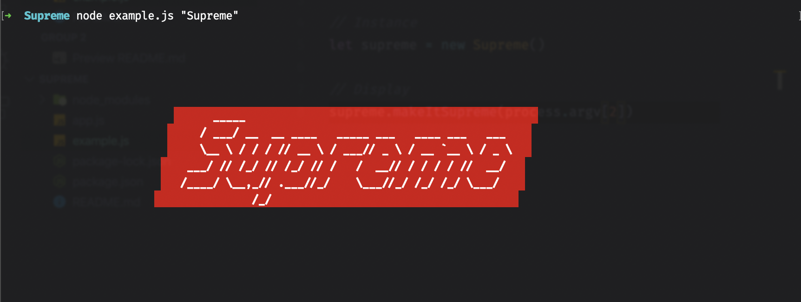

# 😎 Supreme-Title: Write your title with Supreme style



It is pretty useful as you can see and it fits in any projects 😙 

## 🚀 Usage
> Install it:
```sh
npm i supreme-title
```

> Import and initialize the class like that:
```js
// Import
const Supreme = require('supreme-title')

// Display title
new Supreme().makeItSupreme("My awesome title")
```

## 🤔 Run the example
> You are still not convinced of this module? Running the example will change your mind forever.

```sh
# Clone the repository
git clone https://github.com/vlourme/supreme-title

# Enter it
cd supreme-title

# Run example
node example.js "My awesome title"
```

## 🤗 Credits
- [Figlet](https://www.npmjs.com/package/figlet) for the font (Slant)
- [Chalk](https://www.npmjs.com/package/chalk) for the colors